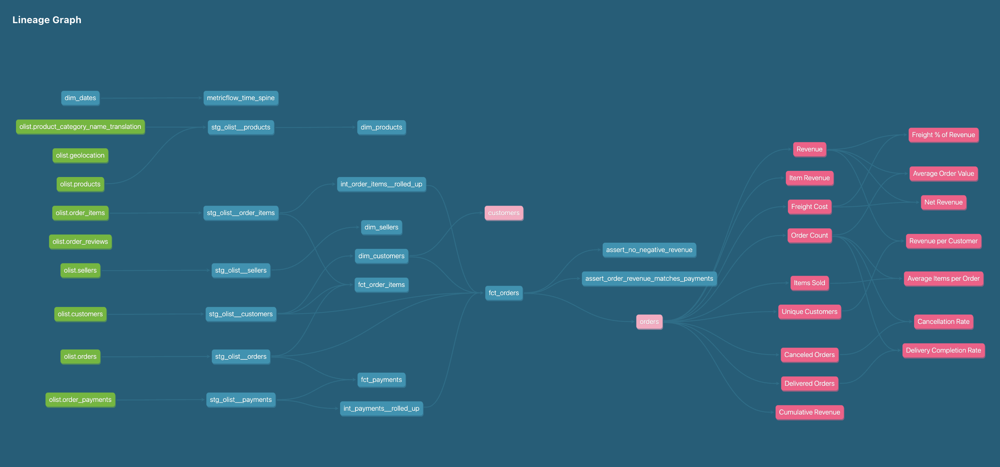

# Olist E-Commerce Analytics - dbt + DuckDB + Semantic Layer

End-to-end analytics engineering project on the [Olist Brazilian E-Commerce Dataset](https://www.kaggle.com/datasets/olistbr/brazilian-ecommerce) (~100K real orders), demonstrating the full modern data stack: **automated ingestion → dbt transformations → Kimball star schema → MetricFlow semantic layer**.

> Built as a portfolio project to showcase modern analytics engineering practices — dimensional modeling, semantic layers, governed metrics, and continuous data quality testing.

---

## Lineage Graph



**Pipeline at a glance:** 9 raw sources → 6 staging views → 2 ephemeral intermediates → 8 mart tables (4 dimensions, 3 facts, 1 time spine) → 2 semantic models → 15 governed metrics. Builds in ~0.6 seconds against DuckDB.

---

## What this project demonstrates

- **Dimensional modeling** — Kimball-style star schema with surrogate keys, conformed dimensions, and proper fact-grain choices (order, line-item, installment)
- **Layered architecture** — sources → staging → intermediate → marts → semantic, each with a clear single responsibility
- **MetricFlow semantic layer** — 15 governed metrics (simple, ratio, derived, cumulative) defined once, available everywhere
- **Schema reverse-engineering** — primary and foreign keys discovered empirically and codified as continuously-tested dbt contracts
- **Real data quality investigation** — surfaced and root-caused Brazilian credit-card installment patterns (see story below)
- **Reproducible from scratch** — kagglehub-driven loader, Poetry-managed dependencies, single-warehouse DuckDB target

---

## Tech stack

| Layer | Tool |
|---|---|
| Warehouse | [DuckDB](https://duckdb.org/) (local, embedded, columnar) |
| Transformations | [dbt Core 1.11](https://www.getdbt.com/) |
| Semantic Layer | [MetricFlow](https://docs.getdbt.com/docs/build/about-metricflow) (Apache 2.0) |
| Dependency mgmt | [Poetry](https://python-poetry.org/) |
| Data ingestion | [kagglehub](https://github.com/Kaggle/kagglehub) |
| Lineage / docs | dbt's built-in docs site |

---

## Architecture

```
Olist Kaggle CSVs
       ↓ load_data/load_olist.py (kagglehub + DuckDB)
DuckDB raw schema  ──────────────────  9 source tables
       ↓ dbt staging
staging schema     ──────────────────  6 views (cleanup, type casting, derived flags)
       ↓ dbt intermediate
(ephemeral)        ──────────────────  2 reusable rollups (compiled inline)
       ↓ dbt marts
marts schema       ──────────────────  4 dimensions + 3 facts + time spine
       ↓ MetricFlow
semantic layer     ──────────────────  2 semantic models, 15 metrics
       ↓
BI tools / agents / dashboards
```

---

## Repository structure

```
olist-ecommerce-analytics-dbt/
├── load_data/
│   └── load_olist.py            # Downloads Olist via kagglehub, loads into DuckDB
├── dbt/
│   ├── dbt_project.yml
│   ├── profiles.yml
│   ├── models/
│   │   ├── staging/             # 6 cleanup views
│   │   ├── intermediate/        # 2 ephemeral rollups
│   │   └── marts/
│   │       ├── core/            # 4 dimensions, 3 facts, time spine
│   │       └── semantic/        # MetricFlow YAML
│   └── tests/                   # Custom singular tests
├── docs/
│   └── lineage-graph.png
├── pyproject.toml               # Poetry dependencies
└── README.md
```

---

## Quickstart

```bash
# 1. Clone and install dependencies
git clone git@github.com:ViswanathRajuIndukuri/olist-ecommerce-analytics-dbt.git
cd olist-ecommerce-analytics-dbt
poetry install

# 2. Download data and load into DuckDB
poetry run python load_data/load_olist.py
# → Downloads from Kaggle, creates load_data/olist.duckdb with raw schema

# 3. Run dbt pipeline
cd dbt
poetry run dbt deps   --profiles-dir .
poetry run dbt run    --profiles-dir .   # builds 14 models in ~0.6s
poetry run dbt test   --profiles-dir .   # runs 84 data tests

# 4. Query metrics via the semantic layer
poetry run dbt sl query --metrics revenue --group-by metric_time__month --profiles-dir .
poetry run dbt sl query --metrics avg_order_value --group-by orders__payment_type --profiles-dir .
poetry run dbt sl list metrics --profiles-dir .

# 5. Browse the docs site (lineage graph + model docs)
poetry run dbt docs generate --profiles-dir .
poetry run dbt docs serve    --profiles-dir .
# Opens at http://localhost:8080
```

---

## The data model — Sales & Revenue domain

### Star schema (marts layer)

**Dimensions:**
| Model | Grain | Notes |
|---|---|---|
| `dim_dates` | One row per day | Spine 2016-01-01 → 2018-12-31, all calendar attributes |
| `dim_customers` | One row per `customer_unique_id` | Stable person identity (NOT per-order `customer_id`) |
| `dim_products` | One row per product | English category names, weight buckets, volume |
| `dim_sellers` | One row per seller | Brazilian region rollup (Southeast, South, etc.) |

**Facts:**
| Model | Grain | Use cases |
|---|---|---|
| `fct_orders` | One row per order | Revenue, AOV, cancellation rate |
| `fct_order_items` | One row per `(order_id, item_sequence)` | Per-product / per-seller analysis |
| `fct_payments` | One row per installment | Payment method analysis, installment patterns |

### Semantic layer (15 metrics)

| Type | Metrics |
|---|---|
| **Simple** | `revenue`, `item_revenue`, `freight_cost`, `order_count`, `items_sold`, `unique_customers` |
| **Ratio** | `avg_order_value`, `cancellation_rate`, `delivery_completion_rate`, `freight_pct_of_revenue`, `avg_items_per_order`, `revenue_per_customer` |
| **Derived** | `net_revenue` (= revenue − freight) |
| **Cumulative** | `cumulative_revenue` (running total) |

Each metric is defined **once** in YAML and queryable from anywhere — BI tools, the dbt CLI, future AI agents.

---

## Sample queries via the semantic layer

```bash
# Monthly revenue trend
poetry run dbt sl query --metrics revenue --group-by metric_time__month

# AOV by payment method
poetry run dbt sl query --metrics avg_order_value --group-by orders__payment_type

# Cancellation rate by quarter
poetry run dbt sl query --metrics cancellation_rate --group-by metric_time__quarter

# Multi-metric: revenue, order count, AOV by year
poetry run dbt sl query --metrics revenue,order_count,avg_order_value --group-by metric_time__year
```

---

## Data quality — 84 tests, 1 calibrated outlier

The project ships with **84 data quality tests**:

- **Source tests** — uniqueness, not-null, accepted values, foreign-key relationships on all 9 raw tables
- **Model tests** — surrogate key uniqueness, FK integrity across the star schema
- **Custom singular tests** — business-rule checks like negative-revenue and revenue-payment reconciliation

**Result:** `PASS=83  WARN=1  ERROR=0`

### Investigation: Brazilian credit card installment patterns

While building the test suite, the custom test `assert_order_revenue_matches_payments` initially flagged 247 orders with revenue/payment discrepancies. Rather than suppress the failure, I treated it as an investigation:

1. **Initial finding** — 247 orders failed a naive 1-BRL tolerance check
2. **Distribution analysis** — discrepancies clustered in the 5–20 BRL range with a long thin tail
3. **Root cause #1** — 96% of failures came from credit-card orders, with uplift correlating to installment count (~6% at 3 installments, ~25% at 20+ installments). This is the Brazilian *parcelado* installment-interest system.
4. **Iteration** — updated test with 35% credit-card tolerance → 247 → 5 failures
5. **Root cause #2** — remaining 5 included unrecorded debit-card discounts (~5%) and one voucher+installment composite case
6. **Final design** — per-payment-method tolerances (35% credit card, 5% debit, 10% voucher) with `severity='warn'`

The test now surfaces ~1 genuine anomaly per run (~0.001% of orders). It functions as ongoing data-quality monitoring rather than a build gate.

---

## What's next — roadmap

### Phase 2 — Customer & Operations Analytics *(in progress)*
- `dim_geographies` from `olist.geolocation` (zip → city → state hierarchy)
- `fct_reviews` from `olist.order_reviews`
- Cohort retention analysis (acquisition month → revenue per period)
- Customer lifetime value (CLV)
- Delivery SLA metrics (on-time rate, fulfillment funnel)

### Phase 3 — AI Agent layer *(planned)*
- LangGraph agent over the semantic layer
- Natural-language → governed metrics via MetricFlow
- Routed architecture: Semantic Layer (governed) ↔ text-to-SQL (exploratory)
- Streamlit chat UI
- Eval harness comparing accuracy across question types

### Phase 4 — Production hygiene *(planned)*
- GitHub Actions CI for `dbt build` on PRs
- Elementary observability for anomaly detection
- Snowflake-target deployment for cloud demonstration

---

## Notes on warehouse portability

The project is built on DuckDB locally for $0 cost and millisecond iteration. Migrating to Snowflake or BigQuery is a single-file change:

```yaml
# dbt/profiles.yml — change `type: duckdb` to `type: snowflake` (or bigquery)
# Update credentials, that's it. SQL is dialect-portable across all three.
```

This portability — local development, cloud deployment — is a core analytics engineering principle and demonstrates a vendor-agnostic understanding of the modern data stack.

---

## License

Project code: MIT.

The Olist dataset is licensed [CC BY-NC-SA 4.0](https://creativecommons.org/licenses/by-nc-sa/4.0/) by Olist. Data is downloaded fresh by `load_olist.py` and is not redistributed in this repository.
